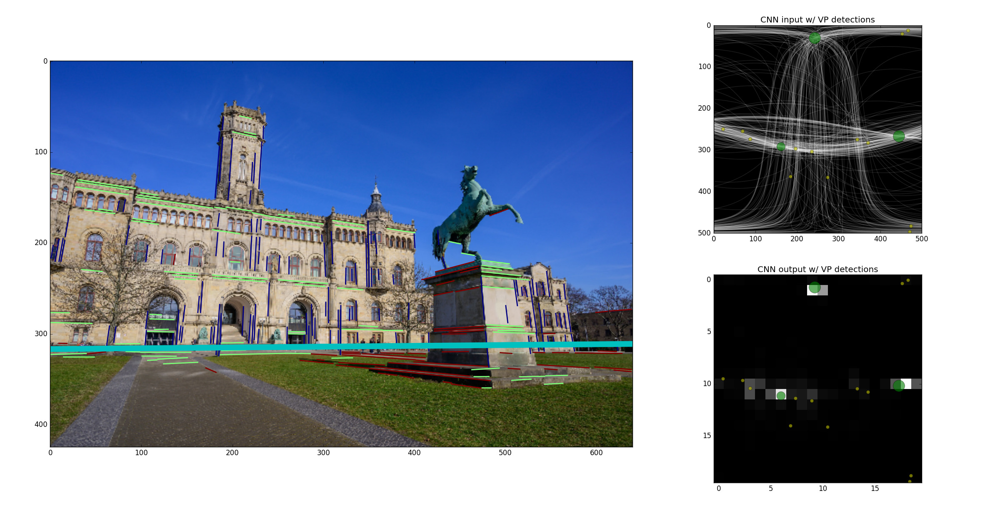
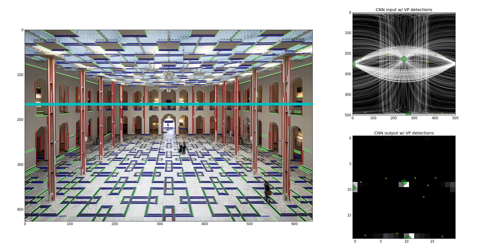
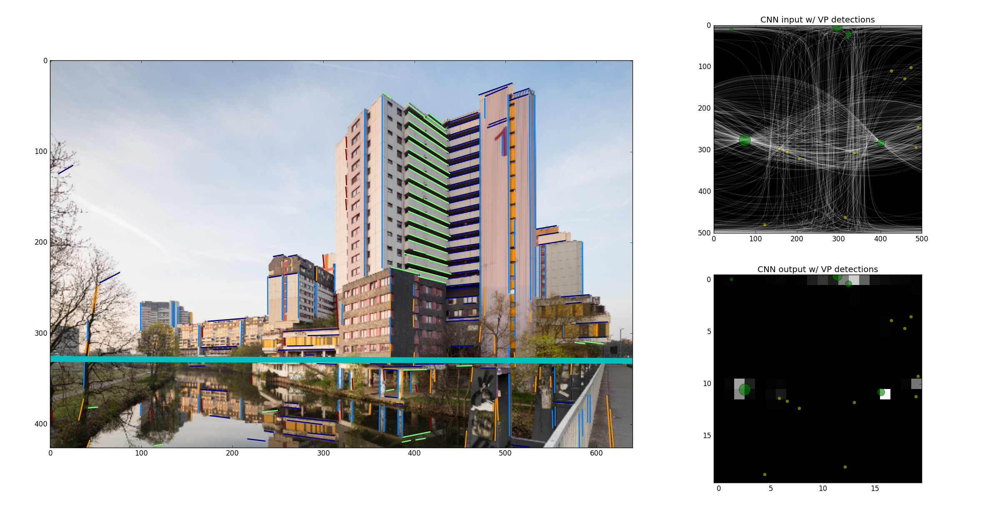
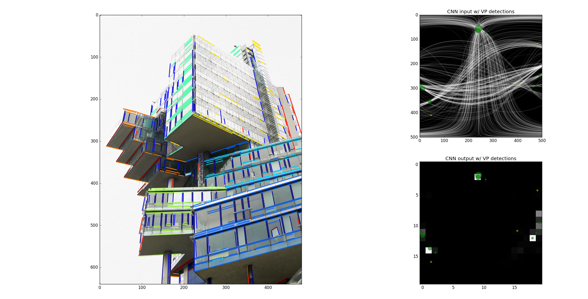

## Deep Learning for Vanishing Point Detection Using an Inverse Gnomonic Projection

### Requirements
* Anaconda w/ Python 2.7
* [Caffe 1.0-RC5](https://github.com/BVLC/caffe/tree/rc5)
* ImageMagick 6.8.8-1
* what ``spec-file.txt`` and ``requirements.txt`` say

Using other versions of these packages may yield different results.

### Setup
* Get the code, install requirements and build LSD:
```
git clone --recursive https://www.tnt.uni-hannover.de:3000/kluger/Vanishing_Points_GCPR17.git
cd Vanishing_Points_GCPR17
conda create --name gcpr17_vp_detection --file spec-file.txt
source activate gcpr17_vp_detection
pip install -r requirements.txt
cd lsdpython
python setup.py build_ext --inplace
cd ..
```
* Download the [CNN weights and image mean files](https://drive.google.com/open?id=1VBBszbCWuVEQ0a7DKVqZNngRsk1Zorei) and 
put them into the ``cnn`` folder.
* Adjust ``config.py`` so that it contains the path to your Caffe installation and the paths where you store 
the [benchmark datasets](#datasets).

### Run
#### Examples
You can run the vanishing point detector on four example images (see below) and visualise the results. 
Computation may take a few moments. Adjust the GPU ID if necessary:
``` 
python example.py --gpu 0
python example.py --show
```
#### Benchmarks
Run the following commands to evaluate the vanishing point detector on the three benchmark datasets and plot the AUC curves:
```
python benchmark.py --yud --gpu 0 --update_datalist --update_datafiles --run_cnn --run_em
python benchmark.py --yud --gpu 0 
python benchmark.py --ecd --gpu 0 --update_datalist --update_datafiles --run_cnn --run_em
python benchmark.py --ecd --gpu 0 
python benchmark.py --hlw --gpu 0 --update_datalist --update_datafiles --run_cnn --run_em
python benchmark.py --hlw --gpu 0 
```

### Examples










### References

If you use the code provided here, please cite:
```
@inproceedings{kluger2017deep,
  title={Deep learning for vanishing point detection using an inverse gnomonic projection},
  author={Kluger, Florian and Ackermann, Hanno and Yang, Michael Ying and Rosenhahn, Bodo},
  booktitle={German Conference on Pattern Recognition (GCPR)},
  year={2017}
}
```
The paper can be found on [arXiv](https://arxiv.org/abs/1707.02427).

The benchmark datasets used in the paper can be found here: <a name='datasets'></a>
* [York Urban Dataset](http://www.elderlab.yorku.ca/resources/york-urban-line-segment-database-information/)
* [Eurasian Cities Dataset](http://graphics.cs.msu.ru/en/research/projects/msr/geometry)
* [Horizon Lines in the Wild](http://www.cs.uky.edu/~jacobs/datasets/hlw/)

The example images show landmarks in Hannover, Germany:
* [Welfenschloss](https://www.flickr.com/photos/shepard4711/40441168973/in/photolist-8KSNgP-24BDyA2-dHQyus-RsMpqr-qfCQuS-91DBT-5aprBZ-7uavc5-7u6BEk-7u6Agv-7u6zBR-7ua1Am-7u6mU4-7u6cdk-7u657F)
* [Lichthof at Leibniz University](https://commons.wikimedia.org/wiki/File:Atrium_Lichthof_main_building_Welfenschloss_Leibniz_Universitatet_Hannover_Am_Welfengarten_Nordstadt_Hannover_Germany.jpg)
* [Ihme-Zentrum](https://commons.wikimedia.org/wiki/Category:Ihme-Zentrum?uselang=de#/media/File:Ihme-Zentrum_Spinnereistrasse_Hanover_Germany.jpg)
* [Nord LB](https://www.flickr.com/photos/dierkschaefer/5999546112/in/photolist-6EywNo-pdpBA8-a97hon-eQ6474-a9acHm-a9a9AG-a9af3d-R5SNyF-a97tck-eQhHCJ-fruEuZ-eQi2tE-eQhk8d-qnVgrW-24fRi2L-eQhyxE-bymrtQ-kU7Apk-a9a74Y-2bxix-PRf3sv-SXwgoU-dyUjRC-jbB22-rgmqm-24awG1H-4zjzyq-TMEpHD-Rer4CD-rt82Av-rgiWa)

